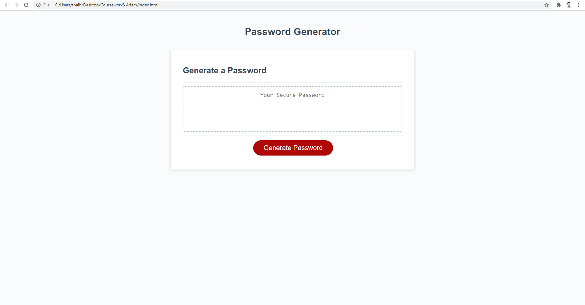

<h1 align="center"> JAVASCRIPT - PASSWORD GENERATOR 🚩</h1>
<br>
<p align="center">
  <a href="#">
  
  <a href="#">
  
  <a href="#">
  
  <a href="#">
  
  <a href="#">
  
  <br>
  <a href="#">
  
  <a href="#">
  
  <a href="https://github.com/ThiHoangPham/password-generator/blob/main/LICENSE">
  
  </a>
  <a href="#">
  
  <a href="#">
  
  </a>
  <a href="#">
  
  </a>
  <a href="#">
  
  </a>
  <a href="#">
  
  </a>
</p>
<hr>

  <h3 align="center">
    <p align="center">
      <a href="https://github.com/ThiHoangPham/password-generator"><strong>Explore the docs »</strong></a>
      <br />
      <br />
      <a href="https://thihoangpham.github.io/password-generator/">Demo</a>
      ·
      <a href="https://github.com/ThiHoangPham/password-generator/issues">Report Bug</a>
      ·
      <a href="https://github.com/ThiHoangPham/password-generator/issues">Request Feature</a>
    </p>
  </table>

  <details>
    <summary>Table of Contents</summary>
    <ul>
      <li><a href="#about-the-project">About The Project</a>
      <li><a href="#user-story">User Story</a></li>
      <li><a href="#acceptance-criteria">Acceptance Criteria</
      <li><a href="#live-demo-github">Live Demo</a></li>
      <li><a href="#contributor">Contributor</a></li>
      <li><a href="#contribution">Contribution</a></li>
      <li><a href="#license">License</a></li>
      <li><a href="#more-about-me">More About Me</a></li>
    </ul>
  </details>

  <br />

# About The Project
  An application that enables employees to generate random passwords based on criteria that they’ve selected. This app will run in the browser and will feature dynamically updated HTML and CSS powered by JavaScript code that you write.

  

# User Story
```
AS AN employee with access to sensitive data
I WANT to randomly generate a password that meets certain criteria
SO THAT I can create a strong password that provides greater security
```

# Acceptance Criteria
```
GIVEN I need a new, secure password
WHEN I click the button to generate a password
THEN I am presented with a series of prompts for password criteria
WHEN prompted for password criteria
THEN I select which criteria to include in the password
WHEN prompted for the length of the password
THEN I choose a length of at least 8 characters and no more than 128 characters
WHEN asked for character types to include in the password
THEN I confirm whether or not to include lowercase, uppercase, numeric, and/or special characters
WHEN I answer each prompt
THEN my input should be validated and at least one character type should be selected
WHEN all prompts are answered
THEN a password is generated that matches the selected criteria
WHEN the password is generated
THEN the password is either displayed in an alert or written to the page
```

# Live Demo Github: 
<a href="https://thihoangpham.github.io/password-generator/">
  
  </a>

# Contributor
<a href="https://github.com/ThiHoangPham/password-generator">
  
  </a>

# Contribution
This how you can contribute to this project:
```
> Clone the project to your local 
> Create your own branch
> Add contribution codes/commit/push to remote repo
> Create a pull request
```
# License
  Distributed under the [MIT License](https://github.com/ThiHoangPham/password-generator/blob/main/LICENSE)

# More About Me
  <a href="https://github.com/ThiHoangPham">
  
  <a href="https://thihoangpham.github.io/react-portfolio/">
  
  <a href="https://www.linkedin.com/in/thaihoangpham/">
  
  <a href="mailto:thaihoangpham2008@gmail.com">
  
  </br>
  <p align ="right"><a href="#">↥ back to top</a></p>

- - -

© 2021 Hoang Thai Pham(Adam): JavaScript - Password Generator
